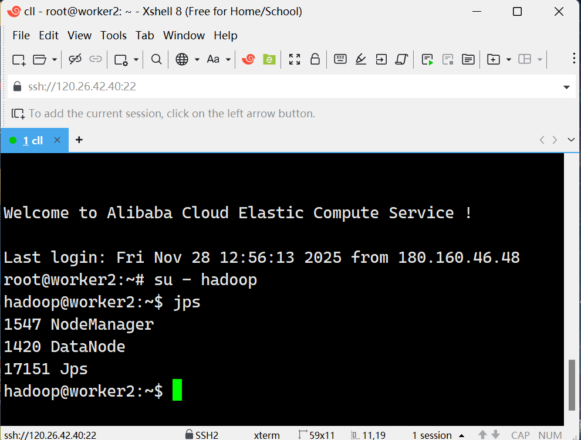
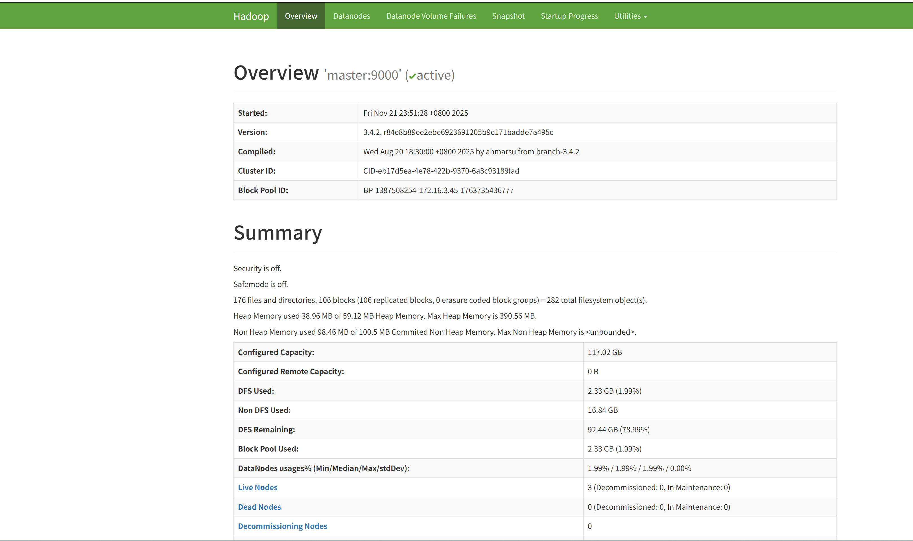
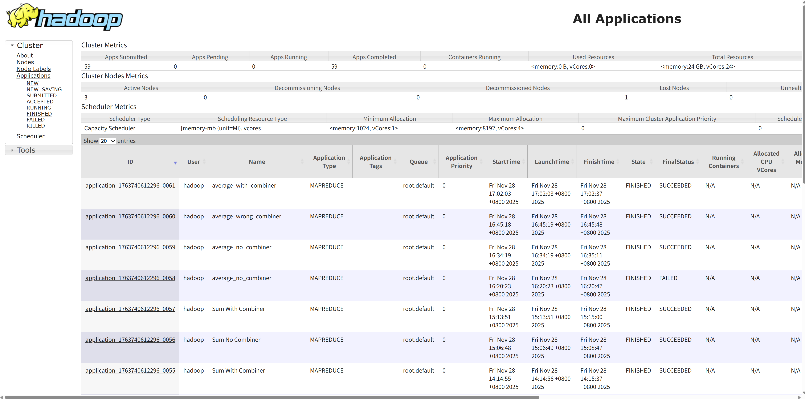

<<<<<<< Updated upstream
<<<<<<< Updated upstream
# DasebigdataAssignmentGroup32
分布式系统小组作业
=======
=======
>>>>>>> Stashed changes
# 📘 **实验报告：MapReduce Combiner 机制分析**

### **研究目的：探究MapReduce中Combiner对作业性能的影响**

------

# **1. 实验环境**

## **1.1 硬件环境（集群配置）**

本次实验基于阿里云 ECS 自建 Hadoop 集群完成，共包含 **4 个节点**：1 个 Master 节点与 3 个 Worker 节点。集群采用 Hadoop **3.4.2** 版本，统一使用 **Linux (Ubuntu 20.04)** 操作系统，并通过 YARN 作为资源管理与任务调度框架。

| 节点    | 角色                       | vCPU | 内存 | 存储类型 | 带宽     |
| ------- | -------------------------- | ---- | ---- | -------- | -------- |
| master  | NameNode + ResourceManager | 2 核 | 2GB  | SSD      | 100 Mbps |
| worker1 | DataNode + NodeManager     | 2 核 | 2GB  | SSD      | 100 Mbps |
| worker2 | DataNode + NodeManager     | 2 核 | 2GB  | SSD      | 100 Mbps |
| worker3 | DataNode + NodeManager     | 2 核 | 2 GB | SSD      | 100 Mbps |

## **1.2 软件环境**

| 组件   | 版本              |
| ------ | ----------------- |
| OS     | Ubuntu 22.04 64位 |
| JDK    | JDK 1.8.0_472     |
| Hadoop | Hadoop 3.4.2      |
| SSH    | Xshell 8          |

------

## 1.3 Hadoop服务进程

(1)master节点


(2)worker1


(3)worker2



(4)worker3


## 1.4 集群端口

| 服务                 | 端口  | 作用                        |
| -------------------- | ----- | --------------------------- |
| HDFS NameNode        | 9870  | 查看 HDFS 文件系统状态      |
| YARN ResourceManager | 8088  | 查看 Application 执行情况   |
| JobHistory Server    | 19888 | 查看 MapReduce 详细历史信息 |

(1)Web UI 9870端口

(2)Web UI 8088端口

## 1.5 HDFS存储结构


## 1.6 集群部署方式

- 采用 阿里云 ECS + VPC 内网 部署

- 配置 SSH 免密通信，实现自动启动 Hadoop 集群

- 所有配置（core-site.xml, hdfs-site.xml, yarn-site.xml, mapred-site.xml）保持一致

#  2.实验负载

## 2.1数据集

|     数据集名称      | 不均衡程度 | 大小  |
| :-----------------: | :--------: | :---: |
|  uniform_100MB.txt  |     0%     | 100MB |
|  uniform_50MB.txt   |     0%     | 50MB  |
|  uniform_25MB.txt   |     0%     | 25MB  |
|  skew60_100MB.txt   |    60%     | 100MB |
|   skew60_50MB.txt   |    60%     | 50MB  |
|  skew_60_25MB.txt   |    60%     | 25MB  |
| extreme90_100MB.txt |    90%     | 100MB |
| extreme90_200MB.txt |    90%     | 200MB |
|      avg_50MB       |            | 50MB  |
<<<<<<< Updated upstream

本实验一共构造了9个数据集。其中，8个数据集用于研究在不同规模和key分布下Combiner的效果：

- **均衡数据集**（key 均匀分布）：
  - 25MB、50MB、100MB 三个规模。
  - 各个 key 出现次数大致相同，没有明显热点 key。
- **倾斜数据集（60%）**：
  - 25MB、50MB、100MB 三个规模。
  - 约 60% 的记录集中在少数热点 key 上，其余记录分布在其他 key 上。
- **倾斜数据集（90%）**：
  - 100MB、200MB 两个规模。
  - 约 90% 的记录集中在更少数的热点 key 上，数据倾斜更严重。

这8个数据集用于求和任务，每条数据的记录格式为：key value，其中key为int型，value值均为1。

avg_50MB数据集用于求平均值的任务，key值均为1，value值为int型。

## 2.2 任务描述

### 任务一：key-value求和（有无Combiner）

任务目标是对输入数据中的所有记录，按照key进行value的求和，输出每个key的总和结果。

在Map阶段，对于输入的文本行“key value”，会解析出字符串key和整数value然后输出中间键值对（key,value)。在Combiner阶段，与Reducer一样，会在Map任务的输出阶段对相同key的value进行局部求和，以此来介绍发往下游的中间键值对的数量，从而减少网络传输和Reduce端的负载。在Reduce极端，Reducer会接收来自多个Map/Combiner的(key,valueSum)对，完成全局求和。

实验设计上，我们对每个数据集都进行两次实验。当关闭Combiner时，Map的输出会直接进入Shuffle阶段；当开启Combiner时，会在Map节点进行局部聚合。通过在不同倾斜度的数据集以及不同大小的数据集上进行实验，来探究有无Combiner对MapReduce作业性能的影响。

### 任务二：按key求平均值

任务目标是对50MB的均衡数据集key计算value的平均值。

直接在Combiner中对value求平均值，然后再在Reducer中对这些“局部平均值”再求平均会得出错误的结果，因为“平均值”本身不满足简单的结合律。所以在求平均值时，需要改变MapReduce的平均值计算模式：将平均值拆分为sum和count两个部分。这两个部分可以进行可结合的加法操作，得出正确的结果。

在Map阶段对于输入的每一条记录，输出(sum,value)和（count,1)，输入Combiner阶段，会对sum和count进行分别求和，这时Combiner只做了加法，满足了结合律和交换律，不会影响最终的结果，同时也大幅度减少了传输到Reducer的中间键值对数量。Reducer最后对多个Map/Combiner输出的值进行累加，得到全局的(sum,count)并求出平均值。

该任务只在avg_50MB一个数据集上进行了实验，通过对比在不使用Combiner、使用错误的模式以及使用正确的支持Combiner的模式这三种情况下的结果，探究Combiner适合使用的任务场景，设计出适合Combiner的聚合逻辑。

__通过上述两类工作负载与多组数据集的结合，本实验可以系统回答以下问题：__

1.Combiner是否能够有效减少Shuffle阶段的数据量？

2.在不同倾斜度的数据集上，Combiner的性能提升有何差异？

3.是否所有场景都适合使用Combiner？

> [!IMPORTANT]
>
> ### 为什么key-value 求和任务适合用 combiner
>
> 因为Combiner本质上是一个在Map端的“迷你Reducer”，它必须能够以任意顺序、任意分组方式处理Map输出的中间结果，而不影响最终结果的正确定性，而结合律和交换律正是保证这种“任意性”不会导致错误的关键属性。
>
> Combiner的作用
>
> 　　在MapReduce中，Combiner的作用是在Map任务完成后，在本地先对输出的<key, value>对进行一次合并，然后再将结果通过网络发送给Reducer。
>
> 　　目的：减少Map和Reduce任务之间的网络传输数据量，提升整体作业性能。
>
> 　　运行位置：它在每个Map任务节点上运行，处理该Map任务自己产生的中间结果。
>
> 因为加法满足结合律和交换律，这两个性质保证了无论数据是如何分布的，只要最终的操作是加法，结果将始终是一样的。这正是使用combiner时的核心优势。
>
> 在 MapReduce 中，数据从 Map 阶段传输到 Reduce 阶段时，传输的中间数据量可能会非常大。通过使用 combiner，我们可以在Map 任务的节点上对相同的 key 进行局部求和，然后将求和结果传递给 Reducer。这样可以显著减少需要传输到Reducer 的数据量。
>
> 由于加法的结合律和交换律，局部合并的顺序不会影响最终结果。即使不同的 Map 任务在不同的节点上并行运行，Reducer 仍然能够得到正确的总和，因为各个节点上的局部结果会被合并成最终的正确结果。这保证了分布式计算中的一致性和正确性。
>
> 使用 combiner 可以减少 Reducer 端的计算负担，因为它收到的数据已经是部分合并过的。例如，Reducer 不需要重复计算每个 key 的所有值的和，而是直接对局部合并的结果进行处理，进一步提高了计算效率。


## 2.3 简要描述Java 代码结构（包名、类名、主要函数）

### （1）`SumWithCombiner.java` 代码结构

包名和导入语句：

引入了必要的 Hadoop 类和 IO 库。

```java
import org.apache.hadoop.conf.Configuration;
import org.apache.hadoop.fs.Path;
import org.apache.hadoop.io.*;
import org.apache.hadoop.mapreduce.*;
import org.apache.hadoop.mapreduce.lib.input.FileInputFormat;
import org.apache.hadoop.mapreduce.lib.output.FileOutputFormat;
```

主类 `SumWithCombiner`：

这是整个程序的核心类，包含了 MapReduce 任务的实现。

Mapper 类 `SumMapper`：

`SumMapper` 继承自 `Mapper<LongWritable, Text, Text, IntWritable>`，负责处理输入数据并生成 key-value 对。

`map()` 方法：输入每一行数据（`LongWritable` 和 `Text`），将其拆分后生成相应的 key 和 value（`Text` 和 `IntWritable`）。

```java
public static class SumMapper extends Mapper<LongWritable, Text, Text, IntWritable> {
    private Text outKey = new Text();
    private IntWritable outValue = new IntWritable();
    
    protected void map(LongWritable key, Text value, Context context) {
        // 按空格分割输入行
        // 提取第一个字段作为key，第二个字段作为value
        // 输出: (key, value)
    }
}
```

Reducer 类 `SumReducer`：

`SumReducer` 继承自 `Reducer<Text, IntWritable, Text, IntWritable>`，负责对 `Mapper` 输出的 key-value 对进行聚合，计算每个 key 的总和。

```java
public static class SumReducer extends Reducer<Text, IntWritable, Text, IntWritable> {
    protected void reduce(Text key, Iterable<IntWritable> values, Context context) {
        // 对相同key的所有value进行求和
        // 输出: (key, sum)
    }
}
```

Job 配置：

在 `main()` 方法中，配置 Hadoop 的 Job，设置输入输出路径、Mapper、Reducer 类，并指定输出的数据类型，设置 `Combiner`（此代码中通过 `job.setCombinerClass(SumReducer.class)` 设置了 `Combiner`）。

```java
public static void main(String[] args) {
    // 创建Job实例
    Job job = Job.getInstance(conf, "Sum With Combiner");
    
    // 设置Mapper和Reducer类
    job.setMapperClass(SumMapper.class);
    job.setReducerClass(SumReducer.class);
    
    // 关键：启用Combiner，直接使用Reducer作为Combiner
    job.setCombinerClass(SumReducer.class);
    
    // 设置输入输出路径
    FileInputFormat.addInputPath(job, new Path(args[0]));
    FileOutputFormat.setOutputPath(job, new Path(args[1]));
}
```


### （２）`SumNoCombiner.java` 代码结构

包名和导入语句：

引入了必要的 Hadoop 类和 IO 库。

```java
import org.apache.hadoop.conf.Configuration;
import org.apache.hadoop.fs.Path;
import org.apache.hadoop.io.*;
import org.apache.hadoop.mapreduce.*;
import org.apache.hadoop.mapreduce.lib.input.FileInputFormat;
import org.apache.hadoop.mapreduce.lib.output.FileOutputFormat;
```

主类 `SumNoCombiner`：

这是整个程序的核心类，包含了 MapReduce 任务的实现，没有使用 Combiner。

Mapper 类 `SumMapper`：

`SumMapper` 继承自 `Mapper<LongWritable, Text, Text, IntWritable>`，与前一个版本相似，负责输入数据的处理并输出 key-value 对。

```java
public static class SumMapper extends Mapper<LongWritable, Text, Text, IntWritable> {
    private Text outKey = new Text();
    private IntWritable outValue = new IntWritable();
    
    protected void map(LongWritable key, Text value, Context context) {
        // 输入格式: "key value"
        // 按空格分割输入行
        // 输出: (Text_key, IntWritable_value)
    }
}
```

Reducer 类 `SumReducer`：

负责对 `Mapper` 输出的 key-value 对进行合并操作，计算每个 key 的总和。

```java
public static class SumReducer extends Reducer<Text, IntWritable, Text, IntWritable> {
    protected void reduce(Text key, Iterable<IntWritable> values, Context context) {
        // 对相同key的所有values进行求和
        int sum = 0;
        for (IntWritable v : values) {
            sum += v.get();
        }
        // 输出: (key, total_sum)
    }
}
```

Job 配置：

在 `main()` 方法中，配置 Hadoop 作业，设置输入输出路径、Mapper、Reducer 类，并指定输出的数据类型，没有使用 `Combiner`，所有的合并工作由 `Reducer` 完成。

```java
public static void main(String[] args) {
    // 创建Job实例
    Job job = Job.getInstance(conf, "Sum No Combiner");
    
    // 设置Mapper和Reducer类
    job.setMapperClass(SumMapper.class);
    job.setReducerClass(SumReducer.class);
    
    // 关键区别：没有设置Combiner
    // job.setCombinerClass(...);  // 此行缺失
    
    // 设置输入输出路径
    FileInputFormat.addInputPath(job, new Path(args[0]));
    FileOutputFormat.setOutputPath(job, new Path(args[1]));
}
```


### （３）`AverageNoCombiner.java` 代码结构

包名和导入语句：

代码首先导入了 Hadoop 和相关的 I/O 类，见（1）。

主类 `AverageNoCombiner`：

整个程序的主类，类名为 `AverageNoCombiner`，用于计算平均值（没有使用combiner）。

Mapper 类 `AvgMapper`：

该类继承自 `Mapper<LongWritable, Text, Text, LongWritable>`，用于处理输入数据并生成中间输出，主要任务是解析输入数据，并生成两个 key-value 对`"sum"` 和总和（`LongWritable`）， `"count"` 和计数（`LongWritable`）

`map()` 方法：该方法解析每行输入数据，提取数值并分别输出 sum 和 count。

```java
public static class AvgMapper extends Mapper<LongWritable, Text, Text, LongWritable> {
    private final static Text SUM = new Text("sum");
    private final static Text COUNT = new Text("count");
    
    protected void map(LongWritable key, Text value, Context context) {
        // 输入格式: "key value" (如 "1 39")
        // 输出两条记录:
        // ("sum", 数值)     - 用于累加总和
        // ("count", 1)     - 用于计数
    }
}
```

Reducer 类 `AvgReducer`：

`AvgReducer` 类对来自 Mapper 的输出进行聚合，计算每个 key 对应的总和和计数，最终计算出平均值，它将处理 `"sum"` 和 `"count"` 的结果，并计算平均值。

```java
public static class AvgReducer extends Reducer<Text, LongWritable, Text, DoubleWritable> {
    long sum = 0;
    long count = 0;
    
    protected void reduce(Text key, Iterable<LongWritable> values, Context context) {
        // 分别处理"sum"和"count"键
        if (key.equals("sum")) {
            for (LongWritable val : values) sum += val.get();
        } else { // count
            for (LongWritable val : values) count += val.get();
        }
    }
    
    protected void cleanup(Context context) {
        // 在所有reduce完成后计算最终平均值
        double avg = (double) sum / count;
        context.write(new Text("Average"), new DoubleWritable(avg));
    }
}
```

Job 配置：

在 `main()` 方法中，配置 Hadoop 的作业，设置输入输出路径、Mapper 和 Reducer 类，并定义输出数据类型。

 

```java
public static void main(String[] args) {
    Job job = Job.getInstance(conf, "average_no_combiner");
    
    job.setMapperClass(AvgMapper.class);
    job.setReducerClass(AvgReducer.class);
    
    // 注意：没有设置Combiner
    // 输出类型：Text, LongWritable (Mapper输出类型)
    
    FileInputFormat.addInputPath(job, new Path(args[0]));
    FileOutputFormat.setOutputPath(job, new Path(args[1]));
}
```


### （4）`AverageWithCombiner.java`代码结构

包名和导入语句：

代码首先导入了 Hadoop 和相关的 I/O 类

主类 `AverageWithCombiner`：

整个程序的主类，类名为 `AverageWithCombiner`，用于计算平均值，并使用了 combiner 来优化性能。

Mapper 类 `AvgMapper`：

该类继承自 `Mapper<LongWritable, Text, Text, LongWritable>`，负责处理输入数据并生成中间输出，主要任务是解析输入数据，并生成两个 key-value 对：`"sum"` 和总和（`LongWritable`）和`"count"` 和计数（`LongWritable`）

`map()` 方法：该方法解析每行输入数据，提取数值并分别输出 sum 和 count。

```java
public static class AvgMapper extends Mapper<LongWritable, Text, Text, LongWritable> {
    private final static Text SUM = new Text("sum");
    private final static Text COUNT = new Text("count");
    
    protected void map(LongWritable key, Text value, Context context) {
        // 输入格式: "key value" (如 "1 39")
        // 输出两条记录:
        // ("sum", 数值)     - 用于累加总和
        // ("count", 1)     - 用于计数
    }
}
```

Combiner 类：

在 `Job` 配置中设置了 `Combiner` 类，这意味着在 Mapper 阶段进行局部合并（例如求和和计数的合并），这样可以减少数据传输量，提高效率。由于加法和计数操作满足结合律和交换律，`Combiner` 可以像 Reducer 一样处理部分数据，优化整个 MapReduce 的性能。

```java
public static class AvgCombiner extends Reducer<Text, LongWritable, Text, LongWritable> {
    protected void reduce(Text key, Iterable<LongWritable> values, Context context) {
        // 对相同键的值进行局部求和
        // "sum"键：对部分数值求和
        // "count"键：对部分计数求和
        // 输出: (key, local_sum) - 保持sum/count格式不变
    }
}
```

Reducer 类 `AvgReducer`：

`AvgReducer` 类对来自 Mapper 的输出进行聚合，计算每个 key 对应的总和和计数，最终计算出平均值。它将处理 `"sum"` 和 `"count"` 的结果，并计算平均值。

```java
public static class AvgReducer extends Reducer<Text, LongWritable, Text, DoubleWritable> {
    long sum = 0;
    long count = 0;
    
    protected void reduce(Text key, Iterable<LongWritable> values, Context context) {
        // 处理Combiner合并后的结果
        if (key.equals("sum")) {
            for (LongWritable v : values) sum += v.get();
        } else { // count
            for (LongWritable v : values) count += v.get();
        }
    }
    
    protected void cleanup(Context context) {
        // 计算最终平均值
        double avg = (double) sum / count;
        context.write(new Text("Average"), new DoubleWritable(avg));
    }
}
```

Job 配置：

在 `main()` 方法中，配置 Hadoop 的作业，设置输入输出路径、Mapper 和 Reducer 类，并定义输出数据类型，还包含了 combiner 的设置，以便 Mapper 层进行局部合并。

```java
public static void main(String[] args) {
    Job job = Job.getInstance(conf, "average_with_combiner");
    
    job.setMapperClass(AvgMapper.class);
    job.setCombinerClass(AvgCombiner.class);  // 关键：启用Combiner
    job.setReducerClass(AvgReducer.class);
    
    // 输出类型：Text, LongWritable
    FileInputFormat.addInputPath(job, new Path(args[0]));
    FileOutputFormat.setOutputPath(job, new Path(args[1]));
}
```


### （５）`AverageWrongCombiner.java`代码结构

包名和导入语句：

代码首先导入了 Hadoop 和相关的 I/O 类

主类 `AverageWrongCombiner`：

整个程序的主类，类名为 `AverageWrongCombiner`，用于计算平均值，但此代码中使用了一个错误的 combiner。

```java
public static class AvgMapper extends Mapper<LongWritable, Text, Text, LongWritable> {
    private final static Text ONEKEY = new Text("avg");
    
    protected void map(LongWritable key, Text value, Context context) {
        // 输入格式: "key value"
        // 输出: ("avg", 数值) - 所有数据使用同一个键
    }
}
```

Mapper 类 `AvgMapper`：

该类继承自 `Mapper<LongWritable, Text, Text, LongWritable>`，负责处理输入数据并生成中间输出，主要任务是解析输入数据，并生成一个固定的 key-value 对：`"avg"` 和对应的数值（`LongWritable`）。

`map()` 方法：该方法解析每行输入数据，提取数值并输出 key `"avg"` 和对应的 value。

```java
public static class AvgMapper extends Mapper<LongWritable, Text, Text, LongWritable> {
    private final static Text ONEKEY = new Text("avg");
    
    protected void map(LongWritable key, Text value, Context context) {
        // 输入格式: "key value"
        // 输出: ("avg", 数值) - 所有数据使用同一个键
    }
}
```

Reducer 类 `AvgReducer`：

`AvgReducer` 类会对来自 Mapper 的输出进行聚合，计算平均值，它将处理 `"avg"` 的所有数值并计算出最终的平均值。

错误的 Combiner 设置：

代码中错误地将 `AvgReducer` 设置为 `Combiner`，这会导致 `Combiner` 的行为不正确，Combiner 本应在 Map 阶段执行局部合并（例如求和和计数），但是在这个错误的实现中，`AvgReducer` 被用作 `Combiner`，它计算的是最终的平均值，而不适合在 Map 阶段进行局部合并。

```java
public static class WrongCombiner extends Reducer<Text, LongWritable, Text, LongWritable> {
    protected void reduce(Text key, Iterable<LongWritable> values, Context context) {
        // ❌ 错误做法：计算局部平均值
        long sum = 0, count = 0;
        for (LongWritable v : values) {
            sum += v.get();
            count++;
        }
        long localAvg = sum / count;   // ❌ 计算局部平均
        // 输出: ("avg", localAvg) - 传递的是平均值而非原始数据
    }
}
```

```java
public static class WrongReducer extends Reducer<Text, LongWritable, Text, DoubleWritable> {
    protected void reduce(Text key, Iterable<LongWritable> values, Context context) {
        // ❌ 对局部平均值再求平均（错上加错）
        long sum = 0, count = 0;
        for (LongWritable v : values) {
            sum += v.get();  // 这里得到的是各个Combiner输出的局部平均值
            count++;
        }
        double wrongFinalAvg = (double) sum / count;
        // 输出: ("WrongAverage", 错误结果)
    }
}
```

Job 配置：

在 `main()` 方法中，配置 Hadoop 的作业，设置输入输出路径、Mapper 和 Reducer 类，并定义输出数据类型。这部分配置与标准的 MapReduce 作业配置相同，但使用了不适当的 `Combiner` 设置。

```java
public static void main(String[] args) {
    Job job = Job.getInstance(conf, "average_wrong_combiner");
    
    job.setMapperClass(AvgMapper.class);
    job.setCombinerClass(WrongCombiner.class);   // ❌ 使用错误的Combiner
    job.setReducerClass(WrongReducer.class);
    
    FileInputFormat.addInputPath(job, new Path(args[0]));
    FileOutputFormat.setOutputPath(job, new Path(args[1]));
}
```

## 3.实验步骤

### 3.1集群与运行环境初始化

见1.3

### 3.2上传数据和代码

**1.准备好数据并上传至HDFS**

上传python脚本文件、生成数据集、上传数据集至HDFS


**2.上传代码**

本地写好Java代码后将java文件上传到节点


**3.并使用Hadoop的class编译**

**4.在Linux上打包成jar**

### 3.3进行实验

**1.每个节点分别在不同数据集执行任务，依次运行有/无combiner的实验**

运行之前需要确认自己的输出目录为空


运行结束后，可在控制台确认作业是否成功，如图出现

- `map 100% reduce 100%`
- `Job job_xxx completed successfully`
  即为成功


**2.实验成功后在Web UI中查看作业详情并记录数据**

Web Ui界面中YARN ResourceManager UI可总览所有YARN任务


MapReduce Job History UI能够看到已经完成的 MapReduce Job，并且能够获取更细致的情况


如图所示，在MapReduce Job的Overview界面查看MapReduce的执行时间


如图所示，以Map的counters为例，可以记录本次实验的关键指标，如：

- Map Output Records
- Map Output Bytes
- Map Output Materialized Bytes
  等

Reduce的数据同理


### 3.3实验数据整理与导出

各组员将数据汇集到表格中，方便进行后续的图表绘制与数据分析

>>>>>>> Stashed changes
=======

本实验一共构造了9个数据集。其中，8个数据集用于研究在不同规模和key分布下Combiner的效果：

- **均衡数据集**（key 均匀分布）：
  - 25MB、50MB、100MB 三个规模。
  - 各个 key 出现次数大致相同，没有明显热点 key。
- **倾斜数据集（60%）**：
  - 25MB、50MB、100MB 三个规模。
  - 约 60% 的记录集中在少数热点 key 上，其余记录分布在其他 key 上。
- **倾斜数据集（90%）**：
  - 100MB、200MB 两个规模。
  - 约 90% 的记录集中在更少数的热点 key 上，数据倾斜更严重。

这8个数据集用于求和任务，每条数据的记录格式为：key value，其中key为int型，value值均为1。

avg_50MB数据集用于求平均值的任务，key值均为1，value值为int型。

## 2.2 任务描述

### 任务一：key-value求和（有无Combiner）

任务目标是对输入数据中的所有记录，按照key进行value的求和，输出每个key的总和结果。

在Map阶段，对于输入的文本行“key value”，会解析出字符串key和整数value然后输出中间键值对（key,value)。在Combiner阶段，与Reducer一样，会在Map任务的输出阶段对相同key的value进行局部求和，以此来介绍发往下游的中间键值对的数量，从而减少网络传输和Reduce端的负载。在Reduce极端，Reducer会接收来自多个Map/Combiner的(key,valueSum)对，完成全局求和。

实验设计上，我们对每个数据集都进行两次实验。当关闭Combiner时，Map的输出会直接进入Shuffle阶段；当开启Combiner时，会在Map节点进行局部聚合。通过在不同倾斜度的数据集以及不同大小的数据集上进行实验，来探究有无Combiner对MapReduce作业性能的影响。

### 任务二：按key求平均值

任务目标是对50MB的均衡数据集key计算value的平均值。

直接在Combiner中对value求平均值，然后再在Reducer中对这些“局部平均值”再求平均会得出错误的结果，因为“平均值”本身不满足简单的结合律。所以在求平均值时，需要改变MapReduce的平均值计算模式：将平均值拆分为sum和count两个部分。这两个部分可以进行可结合的加法操作，得出正确的结果。

在Map阶段对于输入的每一条记录，输出(sum,value)和（count,1)，输入Combiner阶段，会对sum和count进行分别求和，这时Combiner只做了加法，满足了结合律和交换律，不会影响最终的结果，同时也大幅度减少了传输到Reducer的中间键值对数量。Reducer最后对多个Map/Combiner输出的值进行累加，得到全局的(sum,count)并求出平均值。

该任务只在avg_50MB一个数据集上进行了实验，通过对比在不使用Combiner、使用错误的模式以及使用正确的支持Combiner的模式这三种情况下的结果，探究Combiner适合使用的任务场景，设计出适合Combiner的聚合逻辑。

__通过上述两类工作负载与多组数据集的结合，本实验可以系统回答以下问题：__

1.Combiner是否能够有效减少Shuffle阶段的数据量？

2.在不同倾斜度的数据集上，Combiner的性能提升有何差异？

3.是否所有场景都适合使用Combiner？

> [!IMPORTANT]
>
> ### 为什么key-value 求和任务适合用 combiner
>
> 因为Combiner本质上是一个在Map端的“迷你Reducer”，它必须能够以任意顺序、任意分组方式处理Map输出的中间结果，而不影响最终结果的正确定性，而结合律和交换律正是保证这种“任意性”不会导致错误的关键属性。
>
> Combiner的作用
>
> 　　在MapReduce中，Combiner的作用是在Map任务完成后，在本地先对输出的<key, value>对进行一次合并，然后再将结果通过网络发送给Reducer。
>
> 　　目的：减少Map和Reduce任务之间的网络传输数据量，提升整体作业性能。
>
> 　　运行位置：它在每个Map任务节点上运行，处理该Map任务自己产生的中间结果。
>
> 因为加法满足结合律和交换律，这两个性质保证了无论数据是如何分布的，只要最终的操作是加法，结果将始终是一样的。这正是使用combiner时的核心优势。
>
> 在 MapReduce 中，数据从 Map 阶段传输到 Reduce 阶段时，传输的中间数据量可能会非常大。通过使用 combiner，我们可以在Map 任务的节点上对相同的 key 进行局部求和，然后将求和结果传递给 Reducer。这样可以显著减少需要传输到Reducer 的数据量。
>
> 由于加法的结合律和交换律，局部合并的顺序不会影响最终结果。即使不同的 Map 任务在不同的节点上并行运行，Reducer 仍然能够得到正确的总和，因为各个节点上的局部结果会被合并成最终的正确结果。这保证了分布式计算中的一致性和正确性。
>
> 使用 combiner 可以减少 Reducer 端的计算负担，因为它收到的数据已经是部分合并过的。例如，Reducer 不需要重复计算每个 key 的所有值的和，而是直接对局部合并的结果进行处理，进一步提高了计算效率。


## 2.3 简要描述Java 代码结构（包名、类名、主要函数）

### （1）`SumWithCombiner.java` 代码结构

包名和导入语句：

引入了必要的 Hadoop 类和 IO 库。

```java
import org.apache.hadoop.conf.Configuration;
import org.apache.hadoop.fs.Path;
import org.apache.hadoop.io.*;
import org.apache.hadoop.mapreduce.*;
import org.apache.hadoop.mapreduce.lib.input.FileInputFormat;
import org.apache.hadoop.mapreduce.lib.output.FileOutputFormat;
```

主类 `SumWithCombiner`：

这是整个程序的核心类，包含了 MapReduce 任务的实现。

Mapper 类 `SumMapper`：

`SumMapper` 继承自 `Mapper<LongWritable, Text, Text, IntWritable>`，负责处理输入数据并生成 key-value 对。

`map()` 方法：输入每一行数据（`LongWritable` 和 `Text`），将其拆分后生成相应的 key 和 value（`Text` 和 `IntWritable`）。

```java
public static class SumMapper extends Mapper<LongWritable, Text, Text, IntWritable> {
    private Text outKey = new Text();
    private IntWritable outValue = new IntWritable();
    
    protected void map(LongWritable key, Text value, Context context) {
        // 按空格分割输入行
        // 提取第一个字段作为key，第二个字段作为value
        // 输出: (key, value)
    }
}
```

Reducer 类 `SumReducer`：

`SumReducer` 继承自 `Reducer<Text, IntWritable, Text, IntWritable>`，负责对 `Mapper` 输出的 key-value 对进行聚合，计算每个 key 的总和。

```java
public static class SumReducer extends Reducer<Text, IntWritable, Text, IntWritable> {
    protected void reduce(Text key, Iterable<IntWritable> values, Context context) {
        // 对相同key的所有value进行求和
        // 输出: (key, sum)
    }
}
```

Job 配置：

在 `main()` 方法中，配置 Hadoop 的 Job，设置输入输出路径、Mapper、Reducer 类，并指定输出的数据类型，设置 `Combiner`（此代码中通过 `job.setCombinerClass(SumReducer.class)` 设置了 `Combiner`）。

```java
public static void main(String[] args) {
    // 创建Job实例
    Job job = Job.getInstance(conf, "Sum With Combiner");
    
    // 设置Mapper和Reducer类
    job.setMapperClass(SumMapper.class);
    job.setReducerClass(SumReducer.class);
    
    // 关键：启用Combiner，直接使用Reducer作为Combiner
    job.setCombinerClass(SumReducer.class);
    
    // 设置输入输出路径
    FileInputFormat.addInputPath(job, new Path(args[0]));
    FileOutputFormat.setOutputPath(job, new Path(args[1]));
}
```


### （２）`SumNoCombiner.java` 代码结构

包名和导入语句：

引入了必要的 Hadoop 类和 IO 库。

```java
import org.apache.hadoop.conf.Configuration;
import org.apache.hadoop.fs.Path;
import org.apache.hadoop.io.*;
import org.apache.hadoop.mapreduce.*;
import org.apache.hadoop.mapreduce.lib.input.FileInputFormat;
import org.apache.hadoop.mapreduce.lib.output.FileOutputFormat;
```

主类 `SumNoCombiner`：

这是整个程序的核心类，包含了 MapReduce 任务的实现，没有使用 Combiner。

Mapper 类 `SumMapper`：

`SumMapper` 继承自 `Mapper<LongWritable, Text, Text, IntWritable>`，与前一个版本相似，负责输入数据的处理并输出 key-value 对。

```java
public static class SumMapper extends Mapper<LongWritable, Text, Text, IntWritable> {
    private Text outKey = new Text();
    private IntWritable outValue = new IntWritable();
    
    protected void map(LongWritable key, Text value, Context context) {
        // 输入格式: "key value"
        // 按空格分割输入行
        // 输出: (Text_key, IntWritable_value)
    }
}
```

Reducer 类 `SumReducer`：

负责对 `Mapper` 输出的 key-value 对进行合并操作，计算每个 key 的总和。

```java
public static class SumReducer extends Reducer<Text, IntWritable, Text, IntWritable> {
    protected void reduce(Text key, Iterable<IntWritable> values, Context context) {
        // 对相同key的所有values进行求和
        int sum = 0;
        for (IntWritable v : values) {
            sum += v.get();
        }
        // 输出: (key, total_sum)
    }
}
```

Job 配置：

在 `main()` 方法中，配置 Hadoop 作业，设置输入输出路径、Mapper、Reducer 类，并指定输出的数据类型，没有使用 `Combiner`，所有的合并工作由 `Reducer` 完成。

```java
public static void main(String[] args) {
    // 创建Job实例
    Job job = Job.getInstance(conf, "Sum No Combiner");
    
    // 设置Mapper和Reducer类
    job.setMapperClass(SumMapper.class);
    job.setReducerClass(SumReducer.class);
    
    // 关键区别：没有设置Combiner
    // job.setCombinerClass(...);  // 此行缺失
    
    // 设置输入输出路径
    FileInputFormat.addInputPath(job, new Path(args[0]));
    FileOutputFormat.setOutputPath(job, new Path(args[1]));
}
```


### （３）`AverageNoCombiner.java` 代码结构

包名和导入语句：

代码首先导入了 Hadoop 和相关的 I/O 类，见（1）。

主类 `AverageNoCombiner`：

整个程序的主类，类名为 `AverageNoCombiner`，用于计算平均值（没有使用combiner）。

Mapper 类 `AvgMapper`：

该类继承自 `Mapper<LongWritable, Text, Text, LongWritable>`，用于处理输入数据并生成中间输出，主要任务是解析输入数据，并生成两个 key-value 对`"sum"` 和总和（`LongWritable`）， `"count"` 和计数（`LongWritable`）

`map()` 方法：该方法解析每行输入数据，提取数值并分别输出 sum 和 count。

```java
public static class AvgMapper extends Mapper<LongWritable, Text, Text, LongWritable> {
    private final static Text SUM = new Text("sum");
    private final static Text COUNT = new Text("count");
    
    protected void map(LongWritable key, Text value, Context context) {
        // 输入格式: "key value" (如 "1 39")
        // 输出两条记录:
        // ("sum", 数值)     - 用于累加总和
        // ("count", 1)     - 用于计数
    }
}
```

Reducer 类 `AvgReducer`：

`AvgReducer` 类对来自 Mapper 的输出进行聚合，计算每个 key 对应的总和和计数，最终计算出平均值，它将处理 `"sum"` 和 `"count"` 的结果，并计算平均值。

```java
public static class AvgReducer extends Reducer<Text, LongWritable, Text, DoubleWritable> {
    long sum = 0;
    long count = 0;
    
    protected void reduce(Text key, Iterable<LongWritable> values, Context context) {
        // 分别处理"sum"和"count"键
        if (key.equals("sum")) {
            for (LongWritable val : values) sum += val.get();
        } else { // count
            for (LongWritable val : values) count += val.get();
        }
    }
    
    protected void cleanup(Context context) {
        // 在所有reduce完成后计算最终平均值
        double avg = (double) sum / count;
        context.write(new Text("Average"), new DoubleWritable(avg));
    }
}
```

Job 配置：

在 `main()` 方法中，配置 Hadoop 的作业，设置输入输出路径、Mapper 和 Reducer 类，并定义输出数据类型。

 

```java
public static void main(String[] args) {
    Job job = Job.getInstance(conf, "average_no_combiner");
    
    job.setMapperClass(AvgMapper.class);
    job.setReducerClass(AvgReducer.class);
    
    // 注意：没有设置Combiner
    // 输出类型：Text, LongWritable (Mapper输出类型)
    
    FileInputFormat.addInputPath(job, new Path(args[0]));
    FileOutputFormat.setOutputPath(job, new Path(args[1]));
}
```


### （4）`AverageWithCombiner.java`代码结构

包名和导入语句：

代码首先导入了 Hadoop 和相关的 I/O 类

主类 `AverageWithCombiner`：

整个程序的主类，类名为 `AverageWithCombiner`，用于计算平均值，并使用了 combiner 来优化性能。

Mapper 类 `AvgMapper`：

该类继承自 `Mapper<LongWritable, Text, Text, LongWritable>`，负责处理输入数据并生成中间输出，主要任务是解析输入数据，并生成两个 key-value 对：`"sum"` 和总和（`LongWritable`）和`"count"` 和计数（`LongWritable`）

`map()` 方法：该方法解析每行输入数据，提取数值并分别输出 sum 和 count。

```java
public static class AvgMapper extends Mapper<LongWritable, Text, Text, LongWritable> {
    private final static Text SUM = new Text("sum");
    private final static Text COUNT = new Text("count");
    
    protected void map(LongWritable key, Text value, Context context) {
        // 输入格式: "key value" (如 "1 39")
        // 输出两条记录:
        // ("sum", 数值)     - 用于累加总和
        // ("count", 1)     - 用于计数
    }
}
```

Combiner 类：

在 `Job` 配置中设置了 `Combiner` 类，这意味着在 Mapper 阶段进行局部合并（例如求和和计数的合并），这样可以减少数据传输量，提高效率。由于加法和计数操作满足结合律和交换律，`Combiner` 可以像 Reducer 一样处理部分数据，优化整个 MapReduce 的性能。

```java
public static class AvgCombiner extends Reducer<Text, LongWritable, Text, LongWritable> {
    protected void reduce(Text key, Iterable<LongWritable> values, Context context) {
        // 对相同键的值进行局部求和
        // "sum"键：对部分数值求和
        // "count"键：对部分计数求和
        // 输出: (key, local_sum) - 保持sum/count格式不变
    }
}
```

Reducer 类 `AvgReducer`：

`AvgReducer` 类对来自 Mapper 的输出进行聚合，计算每个 key 对应的总和和计数，最终计算出平均值。它将处理 `"sum"` 和 `"count"` 的结果，并计算平均值。

```java
public static class AvgReducer extends Reducer<Text, LongWritable, Text, DoubleWritable> {
    long sum = 0;
    long count = 0;
    
    protected void reduce(Text key, Iterable<LongWritable> values, Context context) {
        // 处理Combiner合并后的结果
        if (key.equals("sum")) {
            for (LongWritable v : values) sum += v.get();
        } else { // count
            for (LongWritable v : values) count += v.get();
        }
    }
    
    protected void cleanup(Context context) {
        // 计算最终平均值
        double avg = (double) sum / count;
        context.write(new Text("Average"), new DoubleWritable(avg));
    }
}
```

Job 配置：

在 `main()` 方法中，配置 Hadoop 的作业，设置输入输出路径、Mapper 和 Reducer 类，并定义输出数据类型，还包含了 combiner 的设置，以便 Mapper 层进行局部合并。

```java
public static void main(String[] args) {
    Job job = Job.getInstance(conf, "average_with_combiner");
    
    job.setMapperClass(AvgMapper.class);
    job.setCombinerClass(AvgCombiner.class);  // 关键：启用Combiner
    job.setReducerClass(AvgReducer.class);
    
    // 输出类型：Text, LongWritable
    FileInputFormat.addInputPath(job, new Path(args[0]));
    FileOutputFormat.setOutputPath(job, new Path(args[1]));
}
```


### （５）`AverageWrongCombiner.java`代码结构

包名和导入语句：

代码首先导入了 Hadoop 和相关的 I/O 类

主类 `AverageWrongCombiner`：

整个程序的主类，类名为 `AverageWrongCombiner`，用于计算平均值，但此代码中使用了一个错误的 combiner。

```java
public static class AvgMapper extends Mapper<LongWritable, Text, Text, LongWritable> {
    private final static Text ONEKEY = new Text("avg");
    
    protected void map(LongWritable key, Text value, Context context) {
        // 输入格式: "key value"
        // 输出: ("avg", 数值) - 所有数据使用同一个键
    }
}
```

Mapper 类 `AvgMapper`：

该类继承自 `Mapper<LongWritable, Text, Text, LongWritable>`，负责处理输入数据并生成中间输出，主要任务是解析输入数据，并生成一个固定的 key-value 对：`"avg"` 和对应的数值（`LongWritable`）。

`map()` 方法：该方法解析每行输入数据，提取数值并输出 key `"avg"` 和对应的 value。

```java
public static class AvgMapper extends Mapper<LongWritable, Text, Text, LongWritable> {
    private final static Text ONEKEY = new Text("avg");
    
    protected void map(LongWritable key, Text value, Context context) {
        // 输入格式: "key value"
        // 输出: ("avg", 数值) - 所有数据使用同一个键
    }
}
```

Reducer 类 `AvgReducer`：

`AvgReducer` 类会对来自 Mapper 的输出进行聚合，计算平均值，它将处理 `"avg"` 的所有数值并计算出最终的平均值。

错误的 Combiner 设置：

代码中错误地将 `AvgReducer` 设置为 `Combiner`，这会导致 `Combiner` 的行为不正确，Combiner 本应在 Map 阶段执行局部合并（例如求和和计数），但是在这个错误的实现中，`AvgReducer` 被用作 `Combiner`，它计算的是最终的平均值，而不适合在 Map 阶段进行局部合并。

```java
public static class WrongCombiner extends Reducer<Text, LongWritable, Text, LongWritable> {
    protected void reduce(Text key, Iterable<LongWritable> values, Context context) {
        // ❌ 错误做法：计算局部平均值
        long sum = 0, count = 0;
        for (LongWritable v : values) {
            sum += v.get();
            count++;
        }
        long localAvg = sum / count;   // ❌ 计算局部平均
        // 输出: ("avg", localAvg) - 传递的是平均值而非原始数据
    }
}
```

```java
public static class WrongReducer extends Reducer<Text, LongWritable, Text, DoubleWritable> {
    protected void reduce(Text key, Iterable<LongWritable> values, Context context) {
        // ❌ 对局部平均值再求平均（错上加错）
        long sum = 0, count = 0;
        for (LongWritable v : values) {
            sum += v.get();  // 这里得到的是各个Combiner输出的局部平均值
            count++;
        }
        double wrongFinalAvg = (double) sum / count;
        // 输出: ("WrongAverage", 错误结果)
    }
}
```

Job 配置：

在 `main()` 方法中，配置 Hadoop 的作业，设置输入输出路径、Mapper 和 Reducer 类，并定义输出数据类型。这部分配置与标准的 MapReduce 作业配置相同，但使用了不适当的 `Combiner` 设置。

```java
public static void main(String[] args) {
    Job job = Job.getInstance(conf, "average_wrong_combiner");
    
    job.setMapperClass(AvgMapper.class);
    job.setCombinerClass(WrongCombiner.class);   // ❌ 使用错误的Combiner
    job.setReducerClass(WrongReducer.class);
    
    FileInputFormat.addInputPath(job, new Path(args[0]));
    FileOutputFormat.setOutputPath(job, new Path(args[1]));
}
```

## 3.实验步骤

### 3.1集群与运行环境初始化

见1.3

### 3.2上传数据和代码

**1.准备好数据并上传至HDFS**

上传python脚本文件、生成数据集、上传数据集至HDFS


**2.上传代码**

本地写好Java代码后将java文件上传到节点


**3.并使用Hadoop的class编译**

**4.在Linux上打包成jar**

### 3.3进行实验

**1.每个节点分别在不同数据集执行任务，依次运行有/无combiner的实验**

运行之前需要确认自己的输出目录为空


运行结束后，可在控制台确认作业是否成功，如图出现

- `map 100% reduce 100%`
- `Job job_xxx completed successfully`
  即为成功


**2.实验成功后在Web UI中查看作业详情并记录数据**

Web Ui界面中YARN ResourceManager UI可总览所有YARN任务


MapReduce Job History UI能够看到已经完成的 MapReduce Job，并且能够获取更细致的情况


如图所示，在MapReduce Job的Overview界面查看MapReduce的执行时间


如图所示，以Map的counters为例，可以记录本次实验的关键指标，如：

- Map Output Records
- Map Output Bytes
- Map Output Materialized Bytes
  等

Reduce的数据同理


### 3.3实验数据整理与导出

各组员将数据汇集到表格中，方便进行后续的图表绘制与数据分析

>>>>>>> Stashed changes
